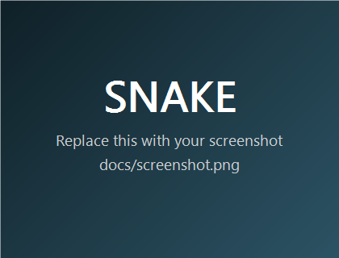

# 🐍 贪吃蛇 Snake

一个使用原生 HTML5 Canvas + JavaScript 编写的现代风格贪吃蛇游戏。无需任何依赖、无需构建工具，**双击 `snake.html` 即可在浏览器中游玩**。

界面采用毛玻璃（Glassmorphism）质感设计，蛇身带渐变配色与发光食物，并对操作手感与渲染性能做了专门优化。

<p align="center">
  
</p>

> 🎬 上面是游戏截图。把你自己的截图保存为 `docs/screenshot.png` 即可替换（也可用 GIF：将文件命名为 `docs/screenshot.gif` 并把上面的 `screenshot.png` 改成 `screenshot.gif`）。

## 🕹️ 在线游玩

部署 GitHub Pages 后，任何人都能直接在浏览器中游玩，无需下载：

**👉 https://jjeerry-ai.github.io/JYT/**

> 该链接在你按下方说明开启 GitHub Pages 后约 1 分钟内生效。

## ✨ 特性

- **零依赖**：纯单文件 HTML，离线可玩，无需安装。
- **现代 UI**：毛玻璃卡片、渐变背景、圆角蛇身、发光苹果、蛇头会看向行进方向。
- **流畅手感**：转向输入带缓冲队列，快速连按不会误判“反向自杀”。
- **稳定帧率**：基于 `requestAnimationFrame` + 时间累积器驱动，节奏稳定不漂移。
- **最高分记录**：通过 `localStorage` 本地保存历史最高分。
- **暂停 / 继续**：随时按空格暂停。

## 🎮 玩法说明

1. 用浏览器打开 `snake.html`。
2. 点击 **开始游戏**。
3. 控制蛇去吃红色的发光苹果，每吃一个得 1 分，蛇身随之变长。
4. **撞到墙壁** 或 **撞到自己的身体** 即游戏结束。
5. 游戏结束后点击 **再玩一次** 重新开始；你的最高分会被自动记录。

## ⌨️ 操作按键

| 操作 | 按键 |
| --- | --- |
| 向上移动 | `↑` 或 `W` |
| 向下移动 | `↓` 或 `S` |
| 向左移动 | `←` 或 `A` |
| 向右移动 | `→` 或 `D` |
| 暂停 / 继续 | `空格` |

> 提示：蛇不能直接 180° 反向。例如正在向右移动时，按左键不会立即掉头。

## 🚀 快速开始

```bash
# 克隆仓库
git clone https://github.com/jjeerry-ai/JYT.git
cd JYT

# 直接用浏览器打开即可（任选其一）
#   Windows:  双击 snake.html
#   或在终端: start snake.html
```

## 🛠️ 技术亮点

这个项目虽小，但在实现上做了几处值得一提的工程优化：

- **输入缓冲队列**
  转向指令先进入一个最多缓冲 2 个方向的队列，并在每个逻辑步进时过滤掉反向与重复输入。这避免了“同一帧内连按两个方向导致瞬间撞向自己”的经典 Bug，让操作更跟手。

- **requestAnimationFrame + 时间累积器**
  主循环用 `requestAnimationFrame` 替代 `setTimeout` 驱动，配合时间累积器（accumulator）控制蛇的步进节奏。即使浏览器掉帧或标签页切换，游戏速度也保持稳定、不会漂移，并能自动补步。

- **逻辑与渲染分离**
  游戏状态更新（`step`）与画面绘制（`draw`）解耦，仅在状态实际变化后才重绘，减少无谓渲染。

- **网格离屏缓存**
  静态背景网格预先绘制到一张离屏 Canvas，每帧只需一次 `drawImage` 贴图，省去了每帧重复绘制几十条网格线的开销。

## 📁 项目结构

```
JYT/
├── index.html      # GitHub Pages 入口（内容与 snake.html 相同）
├── snake.html      # 游戏本体（HTML + CSS + JS 全部在内）
├── docs/
│   └── screenshot.png  # 游戏截图（用于 README 展示）
├── README.md       # 项目说明
└── LICENSE         # Apache-2.0 许可证
```

## ⚙️ 自定义

打开 `snake.html`，在 `<script>` 顶部可调整以下常量：

| 常量 | 含义 | 默认值 |
| --- | --- | --- |
| `GRID` | 每个格子的像素大小 | `20` |
| `SPEED` | 每步移动间隔（毫秒，越小越快） | `110` |

例如想让蛇更快，把 `SPEED` 改成 `80` 即可。

## 🌐 部署到 GitHub Pages

让别人可以直接在线游玩，只需开启一次：

1. 打开仓库的 **Settings（设置）** 页面。
2. 左侧菜单点击 **Pages**。
3. 在 **Build and deployment → Source** 选择 **Deploy from a branch**。
4. **Branch** 选择 `main`，文件夹选择 `/ (root)`，点击 **Save**。
5. 等待约 1 分钟，页面顶部会出现你的访问地址：

   **https://jjeerry-ai.github.io/JYT/**

之后每次 `git push` 更新 `index.html`，线上版本都会自动同步。

## 📄 许可证

本项目基于 [Apache-2.0](LICENSE) 许可证开源。
